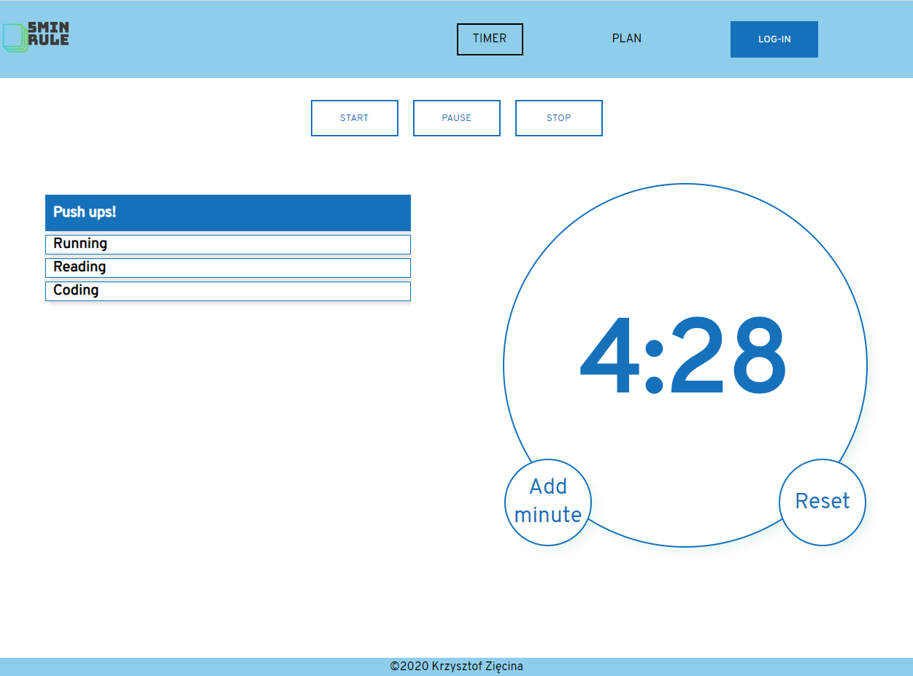

# Golden rule app

> ToDo app that has build in 5 min timer. [live page](https://krissdrawing.github.io/golden-rule/#/)

## Table of contents

- [General info](#general-info)
- [Screenshots](#screenshots)
- [Technologies](#technologies)
- [Features](#features)
- [Contact](#contact)

## General info

ToDo app made for training purposes. It can store tasks in firebase using auth. It has build in timer counting 5 mins for each task. Timer can be poused, stopped or you can add one minute.

## Screenshots

## Technologies

- react - version 16.13
- firebase - version 7.12

## Features

- ToDo list
- firebase auth + db
- 5 min counter

## Contact

Created by [KrissDrawing](https://krissdrawing.pl/) - feel free to contact me!
